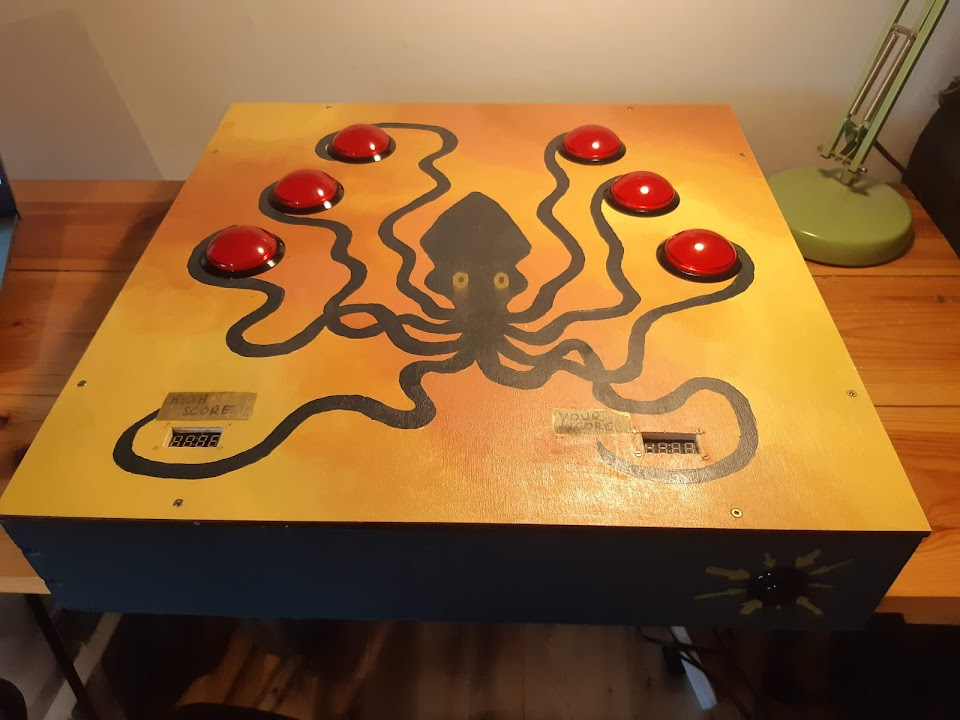

Squid themed reactions game ("Squid Game")
==========================================

Built using a Raspberry Pi and some large arcade buttons.  The buttons light up, and you have to hit the correct button
as quickly as possible.  It makes some silly nosies when you hit each button too.  

## Hardware 

The brain of the game is a Raspberry Pi, which runs the game on startup via systemd.

The 7 segment displays which show the high scores are TM-1637 displays I found cheaply on the internet and the arcade
buttons are some low profile 60mm buttons with built-in 12v LEDs I also found cheaply on the internet.  There are also 
some small speakers and a small prebuilt amplifier in there.

This means there are three interesting voltages to deal with: 12V for the LEDs in the buttons (there is a resistor 
built-in), 5V for the supply to the Raspberry Pi and the displays, and 3.3V for the Raspberry Pi output pins.  I wanted 
a single power supply and I already had a 12v power supply left over, so I used some [DC-DC converters](
https://www.rapidonline.com/TracoPower-TSR-1-2450-Single-Output-DC-DC-Converter-1W-51-7072) to get the 5V
supply voltage needed for the Raspberry Pi and the displays, keeping an eye on the current as 1W is pretty close to the 
amount the Pi needs.  Then to switch on the LEDs, a [2N3904 transistor](
https://www.rapidonline.com/TruSemi-2N3904-Transistor-NPN-TO92-60V-81-0484) setup [as recommended here](
https://elinux.org/RPi_GPIO_Interface_Circuits#Using_an_NPN_transistor).



## Software dev setup

Requires ffmpeg and libasound2-dev on Ubuntu.

## Troubleshooting

To connect direct to raspberry-pi without needing a router, you can use avahi and mdns.  On Ubuntu:

```
sudo apt-get install avahi-daemon avahi-discover avahi-utils libnss-mdns mdns-scan
```

Then plug in the ethernet cable and set to link-local in the network settings.  The Raspberry Pi will be at 
raspberrypi.local.
